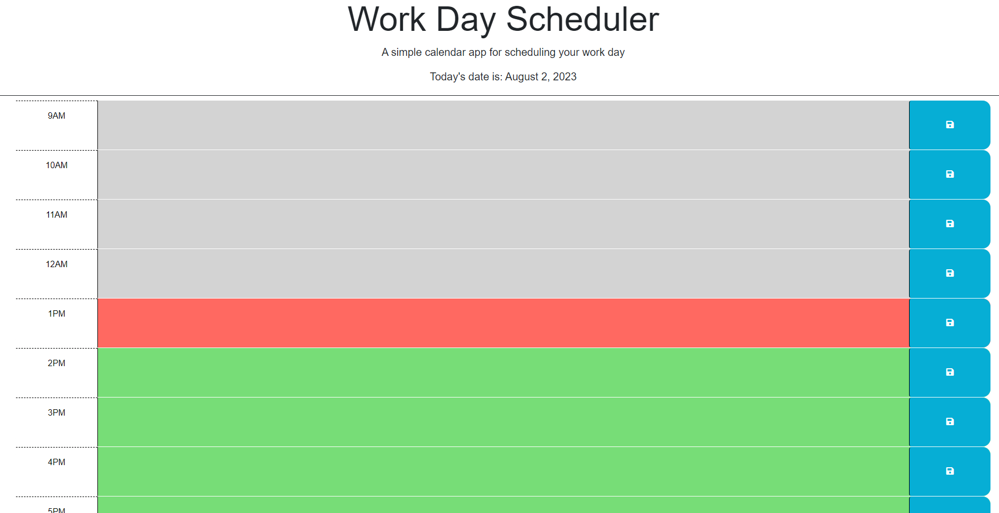
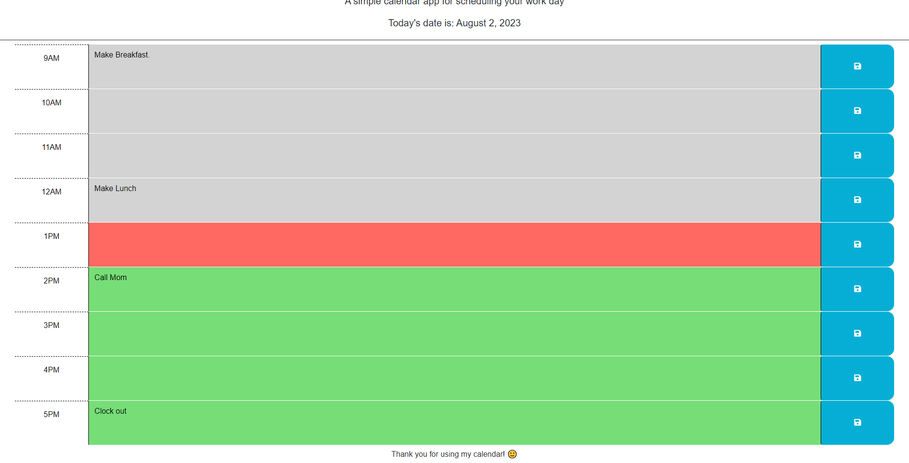

# Calendar-App

## Description

Provide a short description explaining the what, why, and how of your project. Use the following questions as a guide:

I wanted to create a daily planner that would allow someone to organize their activities by the hour.  The text boxes can be edited and saved, keeping their contents after refreshing and reloading so your schedule can be there throughout.  The color of each hour section will change based on the hour of the day so you know where you should be in your schedule.  The project also displays the current date at the top that will update each day.

## Installation

N/A

## Usage

Load up the page and type in whatever you need for each hour. When you update/edit the box for the hour click the save button next to it and it will persist in local storage until you update it again. The color of each box will update based on the current hour of the day so the user can tell how far they should be in their daily plan easily just by a glance.

## Credits

Starter code provided at: https://github.com/coding-boot-camp/crispy-octo-meme

## License

Please refer to the repo.
